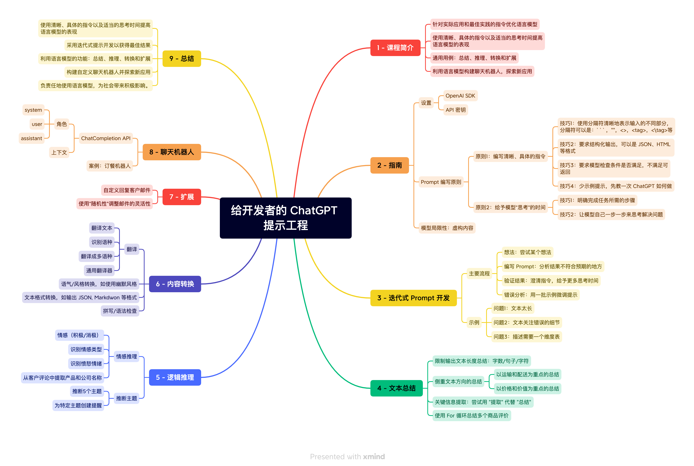
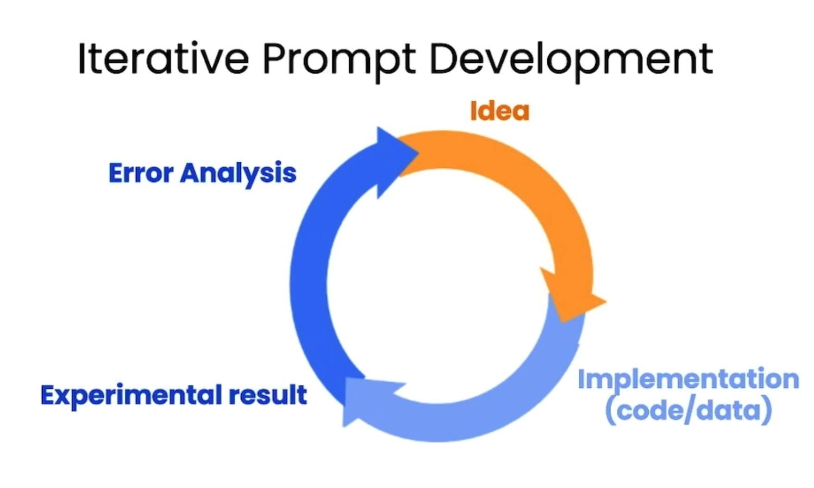

# 《ChatGPT Prompt Engineering for Developers》 学习笔记


《[ChatGPT Prompt Engineering for Developers](https://www.deeplearning.ai/short-courses/chatgpt-prompt-engineering-for-developers/)》 是[吴恩达](https://zh.wikipedia.org/wiki/%E5%90%B4%E6%81%A9%E8%BE%BE)和 [OpenAI](https://openai.com/) 联合推出的针对开发者的 ChatGPT 提示工程（Prompt Engineering）课程。

通过该仓库你可以获得和课程相关的以下内容：

- 课程中使用的 Jupyter 笔记，包含[英文原版](/notebook/)以及[中译版](/notebook/cn/)；
- 课程内容的文字简化版（非译文），快速学习并且不遗漏重点；
- 课程相关内容的延伸材料，可以进一步深入学习；
- 课程大纲的高清[思维导图](/docs/prompt-engineering-xmind.png)，方便你梳理课程脉络及记忆回顾；

根据课程内容绘制的思维导图如下：



---

课程 Jupyter 笔记列表

- [指南](/notebook/cn/l2-%E6%8C%87%E5%8D%97.ipynb)｜ [Guidelines](/notebook/l2-guidelines.ipynb)
- [开发迭代 Prompt](/notebook/cn/l3-%E8%BF%AD%E4%BB%A3%E5%BC%8F%20Prompt%20%E5%BC%80%E5%8F%91.ipynb) ｜ [Iterative Prompt Develelopment](/notebook/l2-guidelines.ipynb)
- [文本总结](/notebook/cn/l4-%E6%96%87%E6%9C%AC%E6%80%BB%E7%BB%93.ipynb) ｜ [Summarizing](/notebook/l4-summarizing.ipynb)
- [逻辑推理](/notebook/cn/l5-%E6%8E%A8%E6%96%AD.ipynb) ｜ [Inferring](/notebook/l5-inferring.ipynb)
- [内容转换](/notebook/cn/l6-%E6%96%87%E6%9C%AC%E8%BD%AC%E6%8D%A2.ipynb) ｜ [Transforming](/notebook/l6-transforming.ipynb)
- [文本扩展](/notebook/cn/l7-%E6%89%A9%E5%B1%95.ipynb) ｜ [Expanding](/notebook/l7-expanding.ipynb)
- [订餐机器人](/notebook/cn/l8-%E8%81%8A%E5%A4%A9%E6%9C%BA%E5%99%A8%E4%BA%BA.ipynb) ｜ [Chatbot](/notebook/l8-chatbot.ipynb)

---

🚧🚧🚧 Working in Progress 🚧🚧🚧


## 一、课程简介

目前互联网上已经有不少关于 ChatGPT Prompt 最佳实践的文章，这些主要是针对 ChatGPT Web 用户的。作为开发者，我们有更多的方法发挥挖掘 ChatGPT 的能力，让其更好的为我们服务。该课程主要就是侧重在开发者（编码方式）如何跟高效的使用 Prompt 提示词，当然有些策略和技巧同样适用于 Web 页面。

该课程主要包括以下几个方向：

- OpenAI 工程化：如何在 Jupyter 中使用 OpenAI SDK；
- 编写 Prompt 的原则及技巧；
- 迭代优化 Prompt 的步骤及示例；
- Prompt 在文本总结/逻辑推理/内容转换/文本扩展等方面具体使用；
- 小型项目：订餐机器人的开发；

## 二、Prompt 编写指南

> Jupyter 笔记：[英文](/notebook/l2-guidelines.ipynb)/[中文](/notebook/cn/l2-%E6%8C%87%E5%8D%97.ipynb)

### 编写 Prompt 的两个基本原则

#### 原则1: 编写清晰/具体的指令

在没有任何上下文的前提下，ChatGPT 不会也没有信息去揣测你的真实意图，所以你在在询问 ChatGPT 时，需要把自己的需求（期望 ChatGPT 帮你做的事情）描述清楚，这样它才会很好的回答你的问题。除此之外，Prompt 和需要处理的文本内容也有可能会导致 ChatGPT 傻傻分不清楚。

有下面的技巧可以确保你编写的 Prompt 尽可能的清晰具体。

##### 技巧1：使用分隔符清晰地表示输入与指令的内容

分隔符可以是：**```**，""，<>，<tag>等，下面示例是使用 `<>` 包裹需要被处理的内容。
注意，需要查看一下内容中是否有和使用标识符相同的元素，如有的话尽量替换成其他的标识符，防止 ChatGPT 混淆指令与内容。

<details>

<summary>使用 <> 包裹内容，点击展开查看代码细节</summary>

```python
text = f"""
# 此处时需要被总结的文本
"""
prompt = f"""
将由三个反引号分隔的文本总结成一个句子。
<{text}>
"""
response = get_completion(prompt)
print(response)
```

</details>

##### 技巧2：要求结构化输出，可以是 JSON、HTML 等格式

作为开发者，我们期望 ChatGPT 可以返回一下结构化的数据，方便我们使用代码解析处理。

<details>

<summary>要求返回 JSON 格式，点击展开查看代码细节</summary>

```python
prompt = f"""
生成三个虚构的中文书名及其作者和类型的清单。 
使用以下键以 JSON 格式提供它们：book_id, title, author, genre.
"""
response = get_completion(prompt)
print(response)
```

ChatGPT 返回内容：

```json
[
  {
    "book_id": 1,
    "title": "荒野之心",
    "author": "张三",
    "genre": "冒险"
  },
  {
    "book_id": 2,
    "title": "红尘梦",
    "author": "李四",
    "genre": "言情"
  },
  {
    "book_id": 3,
    "title": "天涯孤客",
    "author": "王五",
    "genre": "历史"
  }
]
```

</details>

除了上诉的 JSON/HTML 之外，还有哪些通用的文本数据类型？我觉得读者可以发挥自己的想象力，比如：

- 制作 UML 的 [StarUML](https://staruml.io/)；
- 制作流程图的 [Mermaid](https://mermaid.js.org/) ；
- 制作 PPT 的 [MindShow](https://www.mindshow.fun/#/home)；
- 制作音乐的 [Sonic Pi](https://sonic-pi.net/) ；

##### 技巧3：少样本 Prompt，先教一次 ChatGPT 如何做

除了上诉的一些标准的格式 ChatGPT 可以正常的返回，对于一些我们独有的格式要求也可以教 ChatGPT 如何返回。

<details>

<summary>要求返回 JSON 格式，点击展开查看代码细节</summary>

```python
prompt = f"""
prompt = f"""
你的任务是以一致的风格回答。

<孩子>：教我耐心。
<祖父母>： 雕刻最深山谷的河流来自一个谦虚的泉水； 最伟大的交响乐源于一个音符； 最复杂的挂毯始于一根单独的线。
<孩子>：教我韧性。
"""
response = get_completion(prompt)
print(response)
```

ChatGPT 返回内容：

```console
<祖父母>：像一棵树一样，你需要在风雨中弯曲，但不会折断。你需要学会适应变化，坚持不懈地追求你的目标。记住，韧性是一种品质，需要不断地锻炼和培养。
```

</details>

当然对于一些并太好使用语言进行准确描述的要求/指令，我们可以使用少样本（Few-shot）微调的方式现场指导 ChatGPT 如何回答。

##### 技巧4：要求模型检查条件是否满足，不满足可返回指定内容

在编写代码的时候，我们难能够考虑到所有的输入数据情况，如果你开发的工具是直接交付给用户进行使用的，那么就更难确保用户的输入数据与指令时否时匹配的。

比如，一个根据输入内容生成待办列表的指令，在能提取到待办项的时候输出对于的待办，没有的时候直接输出没有待办。

<details>

<summary>可以生成 TODO 项，点击展开查看代码细节</summary>

```python
text_1 = "把大象装进冰箱有三步，一打开冰箱，二把大象放进冰箱，三关上冰箱。"
prompt = f"""
将下面使用 <> 包裹文本生成待办列表。
如何文本中没有待办事项，则返回“没有待办”

<{text_1}>
"""
response = get_completion(prompt)
print(response)
```

ChatGPT 返回内容：

```console
- 打开冰箱
- 把大象放进冰箱
- 关上冰箱
```

</details>


<details>

<summary>没有待办，点击查看代码细节</summary>

```python
text_2 = f"""
今天阳光灿烂，鸟儿在歌唱。 这是去公园散步的好天气。 鲜花盛开，树木在微风中轻轻摇曳。 人们出门在外，享受着宜人的天气。 
有的在野餐，有的在玩游戏，有的在草地上放松。 这是在户外度过时光并欣赏大自然之美的完美日子。
"""
prompt = f"""
将下面使用 <> 包裹文本生成待办列表。
如何文本中没有待办事项，则返回“没有待办”

<{text_2}>
"""
response = get_completion(prompt)
print(response)
```

ChatGPT 返回内容：

```console
没有待办。
```

</details>

对于 LLM 中出现的“幻视”现象（一本正经的胡说八道），我们也可通通过此方式进行一定程度的限制。除此之外，程序设计中的错误码设计思考也可以采用这种思路。


#### 原则2: 给模型“思考”的时间

//TODO

如果让你回答一个 57 * 68 的一个算数问题，大部分人不能第一时间的出正确答案。但是通过一些纸笔或者心算就可以得到正确的答案。发现这种现象在 ChatGPT 上也有类似的体现。如何解决这类问题，方法也很简单，就是给模型更多的思考时间。

虽然目前并没有搞清楚 LLM 时如何学习到思维链的，但是这里并不妨碍我们使用它。其实思维链就是要一步步的告诉 ChatGPT 应该如何做，

更多关于思维链内容可以到 OpenAI 官方的 Cookbook 中查看：[techniques to improve reliability](https://github.com/openai/openai-cookbook/blob/main/techniques_to_improve_reliability.md)。

> 备注：有些技巧或策略跟随着 LLM 模型的升级而发生变化，随着模型越来越智能，我们需要掌握的技巧也会越少。有些复杂问题在 GPT-3.5 或者 GPT4 中已经可以很好的进行回答。

##### 技巧1：明确完成任务所需的步骤

//TODO

<details>

<summary>可以生成 TODO 项，点击展开查看代码细节</summary>

```python

```

ChatGPT 返回内容：

```console

```

</details>

##### 技巧2：明确完成任务所需的步骤

//TODO

### OpenAI SDK 使用

//TODO

### 模型限制：幻视

有时候模型对于自己不知道的事情，也会一本正经的胡说八道，这种现象被称为模型的幻视。

<details> 

<summary>介绍一个不存在的产品，点击展开查看代码细节</summary>

```python
prompt = "介绍一下小米公司发布的太阳能手电筒产品"
response = get_completion(prompt)
print(response)
```

ChatGPT 返回内容：

```console
小米公司发布的太阳能手电筒产品是一款高品质、高性能的手电筒，它采用了太阳能充电技术，可以通过太阳能板或USB接口进行充电，非常方便。该手电筒采用了高亮度LED灯，可以提供强大的照明效果，同时还具有防水、防摔等多种保护功能，非常适合户外活动、露营、旅行等场合使用。此外，该手电筒还具有多种照明模式，可以根据不同的需求进行调节，非常实用。总之，小米公司发布的太阳能手电筒产品是一款高品质、高性能的产品，可以为用户提供便捷、实用的照明服务。
```

</details>

对于如何尽量减少这种问题就可以使用原则一中的[技巧4：限定模型输出]()。

<details>

<summary>不知道产品，点击展开查看代码细节</summary>

```python
prompt = "介绍一下小米公司发布的太阳能手电筒产品，如果你不知道的话就回答“不知道”"
response = get_completion(prompt)
print(response)
```

ChatGPT 返回内容：

```console
不知道。
```

</details>

## 三、迭代优化 Prompt 提示词

> Jupyter 笔记：[英文](/notebook/l3-iterative-prompt-development.ipynb)/[中文](/notebook/cn/l3-%E8%BF%AD%E4%BB%A3%E5%BC%8F%20Prompt%20%E5%BC%80%E5%8F%91.ipynb)

在开发的过程中，我们很难精准的一步到编写的 Prompt 就可以完美的完成我们的任务，所以在这个过程中就会存在一个开发和 Debug 的过程。

### Prompt 开发步骤

下面就是一个 Prompt 开发的基本流程：



主要有 4 个关键环节：

1. 编写 Prompt：尝试某个想法，并编写对应的 Prompt 提示词；
2. 验证 Prompt：验证对应的输出结果是否符合预期；
3. 调试 Prompt：尝试使用清晰的指令，以及给予更多思考时间；
4. 改进 Prompt：不断的调试，最终确定最终的 Prompt；

整个环节是一个循环往返的过程，其实是我们正常编码的过程差不多。之前我们 Debug 的是一些具体的 API 调用，只不过现在 Debug 的是一些 Prompt 提示词，这应该就是大家一致提到的 Prompt Engineering 吧。

### 示例演示


<details>

<summary>根据商品评价编写产品说明，点击展开查看代码细节</summary>

```python
product_review = f"""
MacBook Pro特别棒！特别喜欢！m2处理器性能超强！电池续航逆天！不发热！还带有黑科技触控栏！
现在Mac 软件还算蛮多的，常用的办公软件都能有！用来日常办公完全没问题！
我想重点点评一下他的音频接口！这代MacBook Pro 带有先进的高阻抗耳机支持功能！同样的耳机，
插MacBook Pro上，效果要好于iPhone！还有它的录音性能！插上一根简单的转接头后，在配合电容麦，
还有库乐队软件，录音效果逆天！真的特别棒！我有比较老版本的Mac，但这代MacBook Pro的录音效果，
真的比以前的Mac效果要好好多倍！特别逆天！适合音乐人！（个人感觉，不插电源，录音效果似乎会更好！）
"""

prompt = f"""
您的任务是根据用户的商品评价，整理一份对应的产品说明。用户的评价使用 <> 进行包裹。

商品评价：```{product_review}```
"""
response = get_completion(prompt)
print(response)
```

ChatGPT 返回内容：

```console
产品说明：
该款MacBook Pro配备了强大的m2处理器，性能超强，能够满足用户的高性能需求。同时，电池续航能力也非常出色，能够满足用户长时间使用的需求。此外，该款MacBook Pro还配备了黑科技触控栏，为用户提供更加便捷的操作体验。

在软件方面，该款MacBook Pro支持常用的办公软件，能够满足用户的日常办公需求。

特别值得一提的是，该款MacBook Pro配备了先进的高阻抗耳机支持功能，能够为用户提供更好的音频体验。同时，该款MacBook Pro的录音性能也非常出色，能够满足音乐人的录音需求。在使用时，建议不插电源，以获得更好的录音效果。
```

</details>

#### 问题1: 输出的文本内容太长

返回的内容太长了，我们可以限制一下字数。

<details>

<summary>限制字数，点击展开查看代码细节</summary>

```python
prompt = f"""
您的任务是根据用户的商品评价，整理一份对应的产品说明。用户的评价使用 <> 进行包裹。

产品说明限制的 30 字以内。

商品评价：```{product_review}```
"""
response = get_completion(prompt)
print(response)
```

ChatGPT 返回内容：

```console
产品说明：MacBook Pro性能强劲，电池续航长，配备黑科技触控栏和高阻抗耳机支持功能，适合日常办公和音乐制作。录音效果逆天，比老版本的Mac提升多倍。
```

</details>

#### 问题2：输出内容侧重点不符合预期

也可以根据自己的偏好仅仅只关注一些特定的方向，比如侧重在机器性能相关的描述。

<details>

<summary>侧重在性能方面，点击展开查看代码细节</summary>

```python
prompt = f"""
您的任务是根据用户的商品评价，整理一份对应的产品说明。用户的评价使用 <> 进行包裹。

产品说明限制的 30 字以内，重点强调性能相关的方向。

商品评价：```{product_review}```
"""
response = get_completion(prompt)
print(response)
```

ChatGPT 返回内容：

```console
MacBook Pro，M2处理器，电池续航逆天，不发热，黑科技触控栏，高阻抗耳机支持，录音效果逆天，适合音乐人。
```

</details>

#### 问题3: 展示效果不友好

上面的内容展示的还是不易于阅读，我们可以让其输出一个表格形式。

<details>

<summary>表格形式输出效果，点击展开查看代码细节</summary>

```python
prompt = f"""
您的任务是根据用户的商品评价，整理一份对应的产品说明。用户的评价使用 <> 进行包裹。

从多个维度进行阐述，使用表格形式输出。

商品评价：```{product_review}```
"""
response = get_completion(prompt)
print(response)
```

ChatGPT 返回内容：

```console
| 维度 | 说明 |
| --- | --- |
| 处理器 | M2处理器性能超强 |
| 电池续航 | 续航逆天 |
| 散热 | 不发热 |
| 触控栏 | 带有黑科技触控栏 |
| 软件 | Mac 软件蛮多，常用的办公软件都能有 |
| 音频接口 | 先进的高阻抗耳机支持功能，同样的耳机插MacBook Pro上，效果要好于iPhone |
| 录音性能 | 插上转接头后，在配合电容麦和库乐队软件，录音效果逆天，比以前的Mac效果要好好多倍，适合音乐人 |
| 插电源 | 个人感觉，不插电源，录音效果似乎会更好 |
```

</details>

## 四、应用场景

上面介绍了编写 Prompt 的一写基本原则以及如何调试迭代 Prompt 直到符合自己的预期。下面我们会会使用上面的学到的内容，在文本总结/逻辑推理/内容转换/文本扩展等具体的场景中运用上诉的知识，来完成我们具体的任务。

### 文本总结

文本总结是只将大段文本精炼/简化成小段文本的。这个简化的过程最常见的就是限制输出的字数，除此之外还可以只关注某一些自己比较感兴趣的部分。当然如果仅仅是想要知道文本的包含的信息情况，也可以对其内容进行提取。

#### 限制输出文本长度总结：字数/句子/字符

上述内容中演示过限制文本的字数，除了字数之外，还可以从句子/字符来限制。

<details>

<summary>限制在 1 句话，点击展开查看代码细节</summary>

```python
prompt = f"""
您的任务是根据用户的商品评价，整理一份对应的产品说明。用户的评价使用 <> 进行包裹。

总结限制在 1 句话。

商品评价：```{product_review}```
"""
response = get_completion(prompt)
print(response)
```

ChatGPT 返回内容：

```console
MacBook Pro拥有强大的m2处理器、逆天的电池续航、黑科技触控栏和先进的高阻抗耳机支持功能，录音效果逆天，特别适合音乐人使用。
```

</details>

#### 侧重文本方向的总结

上述内容中演示过侧重在性能方面的效果，在这里也可以让其限制在音频相关的内容。

<details>

<summary>侧重在性能方面，点击展开查看代码细节</summary>

```python
prompt = f"""
您的任务是根据用户的商品评价，整理一份对应的产品说明。用户的评价使用 <> 进行包裹。

侧重在音频方面，总结限制在 1 句话。

商品评价：```{product_review}```
"""
response = get_completion(prompt)
print(response)
```

ChatGPT 返回内容：

```console
该款MacBook Pro音频接口先进，支持高阻抗耳机，录音效果逆天，特别适合音乐人使用。
```

</details>

#### 关键信息提取：尝试用 "提取" 代替 "总结"

也可与只关注自己想要获取的信息，比如查看处理器相关的信息。

<details>

<summary>处理器信息，点击展开查看代码细节</summary>

```python
prompt = f"""
您的任务是根据用户的商品评价，整理一份对应的产品说明。用户的评价使用 <> 进行包裹。

提取商品中关于处理器的描述。

商品评价：```{product_review}```
"""
response = get_completion(prompt)
print(response)
```

ChatGPT 返回内容：

```console
处理器描述：m2处理器性能超强！
```

</details>


### 逻辑推理

//TODO

### 内容转换

//TODO
 
### 文本扩展

//TODO

## 五、综合实战：订餐机器人

> Jupyter 笔记：[英文](/notebook/l8-chatbot.ipynb)/[中文](/notebook/cn/l8-%E8%81%8A%E5%A4%A9%E6%9C%BA%E5%99%A8%E4%BA%BA.ipynb)

//TODO

